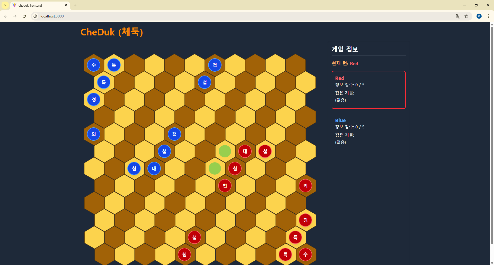

# CheDuk (체둑)

**영토 개념과 이중 승리 조건을 갖춘 현대 추상 전략 보드게임**

체스와 장기에서 영감을 받아 육각형 타일 위에서 진행되는 2인용 추상 전략 보드게임입니다. 바둑의 '영토' 개념과 체스의 '기물 포획'을 결합한 독특한 시스템을 가지며, '수반 격파 승리'와 '첩자 정보 승리'라는 두 가지 승리 조건을 통해 다채로운 전략적 선택지를 제공합니다.

---

## 📌 현재 상태 (Current Status)



**로컬 2인 플레이(Hot-seat)가 가능한 MVP 버전이 완성되었습니다!**

`pnpm` 워크스페이스 기반의 모노레포 구조이므로 루트 디렉토리에서 명령어 실행을 하여 게임의 배치 단계부터 승리 판정까지 모든 핵심 규칙을 경험할 수 있습니다.
`Docker`와 `Docker Compose` 설정이 완료되어 있으므로, `Docker`를 이용한 프로덕션 빌드 및 컨테이너화된 실행이 가능합니다.

---

## ✨ 주요 기능 (Features)

- **완전한 게임 흐름:** 대사(使) 및 첩자(諜) 배치 단계, 메인 게임 플레이, 승리/패배 판정까지 게임의 전체 사이클을 플레이할 수 있습니다.
- **독창적인 기물 규칙:** 국가수반, 외교관, 특사, 대사, 첩자, 경호원 6종의 모든 기물 고유 이동 및 특수 능력이 구현되었습니다.
- **이중 승리 조건:** '수반 격파' 또는 '첩보 점수 5점 달성' 두 가지 승리 조건이 모두 작동합니다.
- **핵심 특수 행동:**
  - 첩자의 '정보 취득' 및 '귀환'
  - 첩자/대사의 '부활'
  - 수반/외교관의 '캐슬링'
- **동적 UI:** 기물 선택 시 이동 가능 범위가 하이라이트되며, 양 플레이어의 영역, 첩보 점수, 포획 기물 현황이 실시간으로 표시됩니다.

---

## 🏛️ 프로젝트 아키텍처

이 프로젝트는 `pnpm` 워크스페이스 기반의 모노레포로 구성되어 있으며, 각 워크스페이스별로 핵심 기능을 명확하게 분리했습니다.

- **`packages/core-logic`: (게임 엔진)**
  - React 등 UI에 대한 의존성이 전혀 없는 순수 TypeScript 라이브러리입니다.
  - 게임의 모든 규칙, 상태(GameState), 유효성 검사, 액션 처리를 담당합니다.
- **`cheduk-frontend`: (게임 클라이언트)**
  - React, Zustand 등의 기술 스택을 사용하여 core-logic 엔진의 상태를 시각화하고 사용자 입력을 처리합니다.
- **`remix-app`: (미래의 온라인 서버)**
  - Socket.IO 서버가 포함되어 있으며, 향후 실시간 멀티플레이 기능 확장을 위한 기반입니다.

---

## 🛠️ 기술 스택 (Tech Stack)

| 구분 | 기술 | 비고 |
|------|----------|------|
| **워크스페이스** | `pnpm` | 모노레포 관리 |
| **프론트엔드 (UI)** | `React`, `TypeScript`, `Vite` | UI 및 클라이언트 로직 (`cheduk-frontend`) |
| **핵심 로직 (engine)** | `TypeScript` | `packages/core-logic`에 초기 구현 (향후 Rust/WASM 전환 고려) |
| **상태 관리** | `Zustand` | 프론트엔드 전역 상태 관리 |
| **코드 품질** | `Biome` | 포맷팅 및 린트 |
| **테스트** | `Vitest` | `core-logic` 단위의 테스트 |
| **백엔드 (계획)** | `Node.js`, `Socket.IO` | 실시간 멀티플레이어용 |
| **컨테이너** | `Docker`, `Docker Compose` | 개발 및 배포 환경 격리 |

---

## 🚀 시작하기 (Getting Started)

### 사전 요구사항
- Node.js (v20.x 이상)
- pnpm
- Docker 및 Docker Compose (프로덕션 실행 시 권장)

### 1. 의존성 설치
프로젝트 루트 디렉토리에서 다음 명령어를 실행합니다.
```bash
pnpm install
```

### 2. 개발 서버 실행
다음 명령어를 실행하면 `cheduk-frontend` (UI)와 `remix-app` (`Socket.IO` 서버)이 동시에 개발 모드로 실행됩니다.
```bash
pnpm run dev
```
- `cheduk-frontend`: http://localhost:3000

### 3. 프로덕션 빌드 및 실행 (Docker)
다음 명령어로 전체 프로젝트의 프로덕션 이미지를 빌드하고 컨테이너를 실행할 수 있습니다.
```bash
docker compose up --build
```
- `cheduk-frontend`: http://localhost:3000
- `remix-app`: http://localhost:5173

---

## 📖 규칙서 (Rulebook)

게임의 상세한 규칙은 아래 공식 규칙서에서 확인하실 수 있습니다.

- [**체둑(CheDuk) 공식 규칙서 (한국어)**](./docs/rulebooks/CheDuk_Rulebook_KOR.md)
- [**CheDuk Official Rulebook (English)**](./docs/rulebooks/CheDuk_Rulebook_ENG.md)

---

## 🗺️ 개발 로드맵 (Roadmap)

MVP가 완성됨에 따라, [상세 개발 계획서](./docs/Development_Plan.md)를 바탕으로 다음과 같은 장기 목표를 추진할 계획입니다.

- **Phase 1: 온라인 멀티플레이**
  - `remix-app`의 `Socket.IO` 서버를 활성화하여 실시간 2인 대전 기능 구현.
  - `gameStore`의 로직을 로컬 처리에서 서버 기반(emit/on)으로 전환.

- **Phase 2: AI 대전 기능**
  - Minimax, Alpha-Beta Pruning 등의 알고리즘을 사용한 AI 상대 개발.

- **Phase 3: 고급 기능**
  - 게임 복기(Replay) 및 분석 기능 추가.
  - 신규 유저를 위한 인터랙티브 튜토리얼 모드 개발.

- **Phase 4: 엔진 최적화 (Long-term)**
  - 성능 최적화 및 기술 학습을 목표로, TypeScript로 구현된 core-logic을 Rust/WebAssembly로 재작성.

---

## 🤝 기여 방법 (Contributing)

이슈 및 PR을 언제나 환영합니다! 특히 온라인 멀티플레이 구현 및 UI/UX 개선에 대한 아이디어가 있다면 자유롭게 제안해 주세요.

---

## 📄 라이선스 (License)

본 프로젝트는 [MIT License](./LICENSE)를 따릅니다.