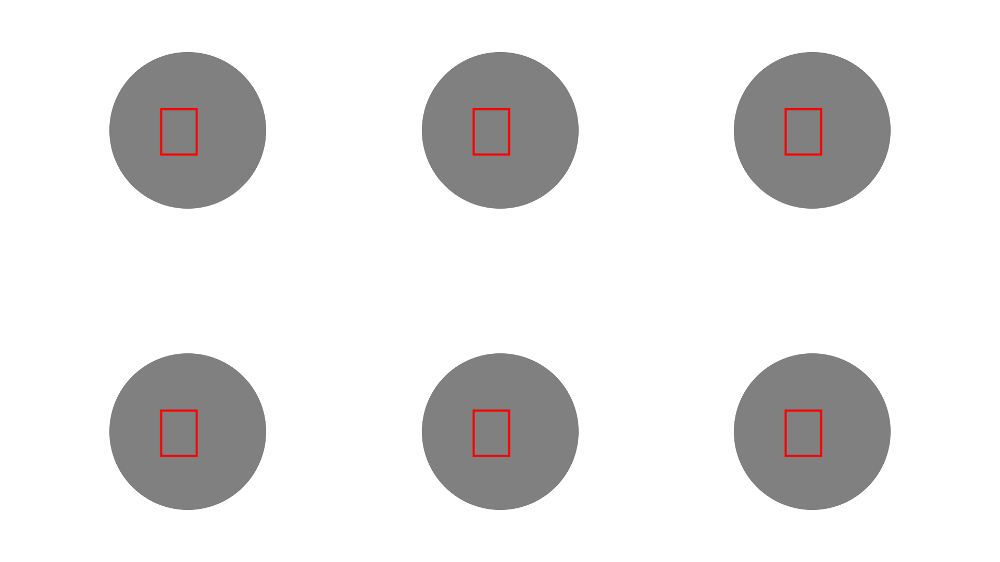
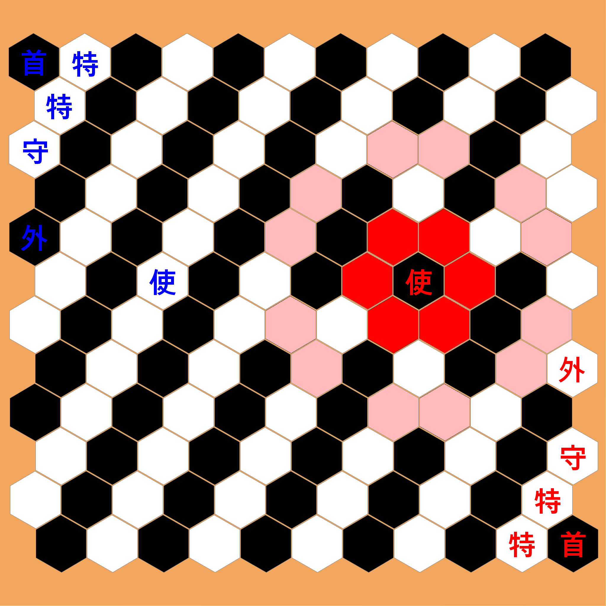
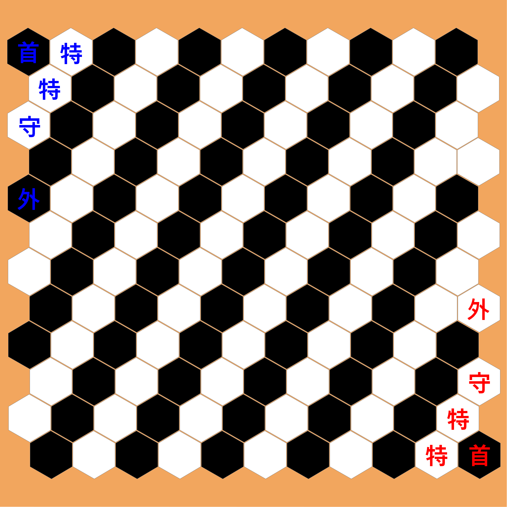
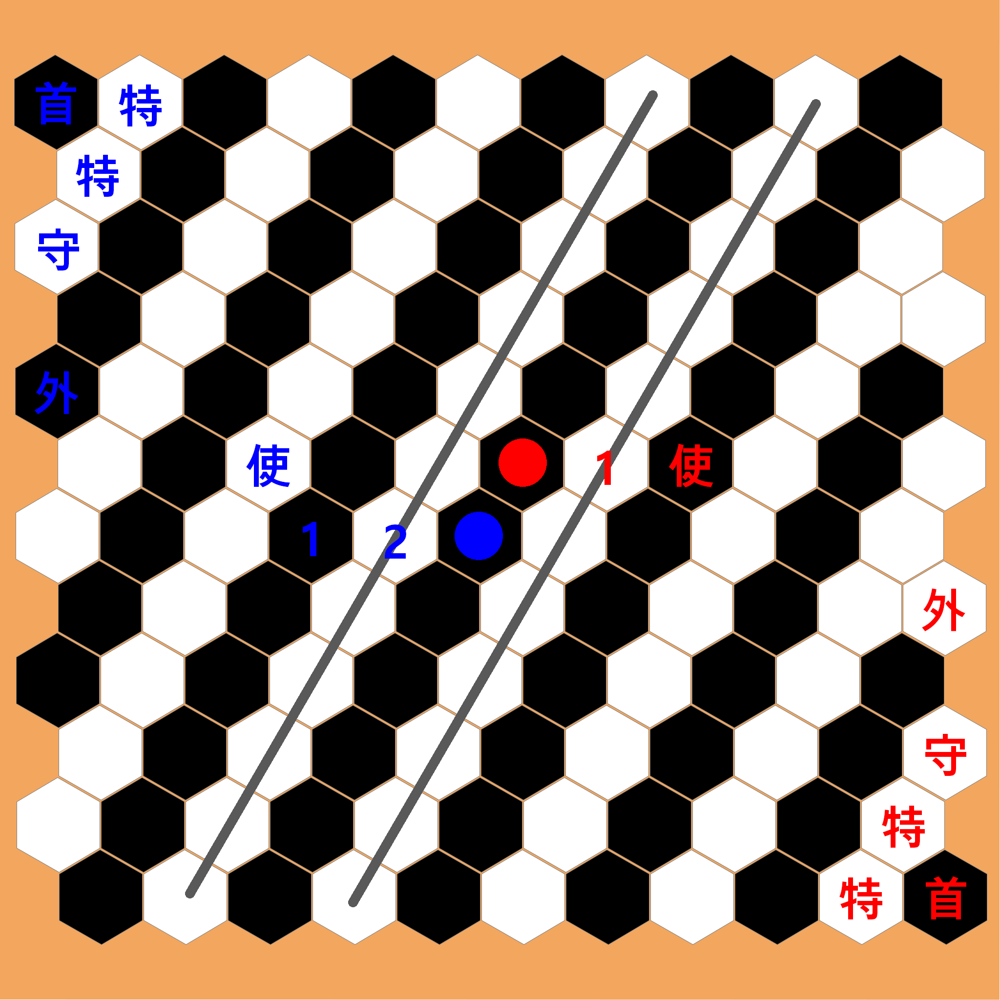
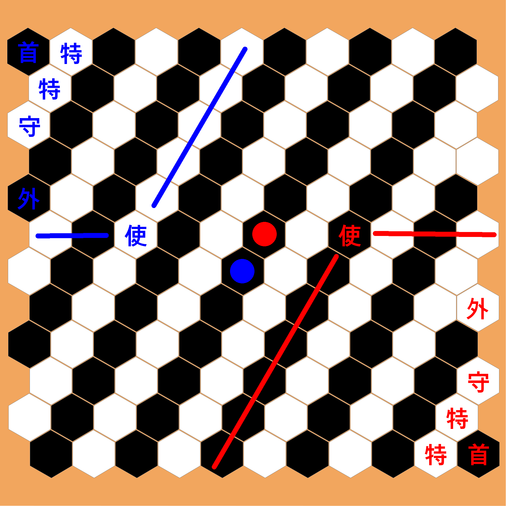
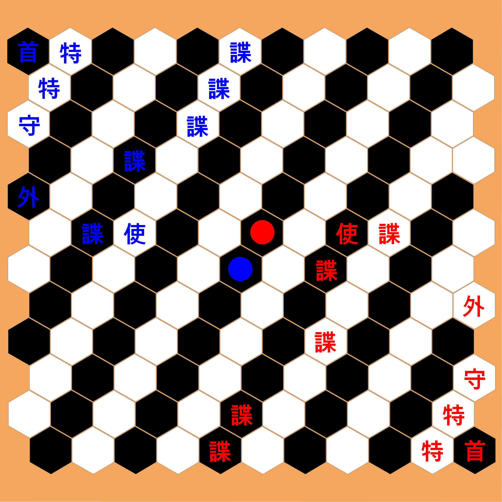

# 체둑(CheDuk) 규칙서 (통합 한국어 버전)

### 0. 요약
체둑은 체스·장기에서 영감을 받아 육각형 타일 위에서 진행되는 2인용 추상전략 보드게임이다. 체둑의 특이점으로는 두 가지 승리 조건이 공존한다는 것이며, 각 승리 조건을 요약하면 다음과 같다.
1.  **첩자(諜) 정보 루트** – 상대 영역(territory)에서 정보 5회 취득 시 즉시 승리
2.  **수반(首) 격파 루트** – 상대 국가수반을 포획 시 승리
게임의 핵심은 대사관(使館)과 영역 시스템, 첩자의 즉시 귀환/부활, 그리고 특사(特)의 점프-직선 제압이다.

---

### 1. CheDuk의 판과 기물

체둑의 판은 위 사진에서 알 수 있듯이 가로로 11개, 세로로 12개의 정육각형이 놓인 타일이다.

기물은 한 진영 기준으로 총 11개가 있으며, 종류는 6개이다.

---

### 2. 기물 상세 규칙

#### 2.1. 국가수반(首) ×1 (고정 시작 위치)
1.  **역할:** 체스의 킹/장기의 궁에 해당. 포획되면 즉시 패배.
2.  **이동:** 인접 1칸(6방향)으로 1칸 이동.
3.  **특수:** **외교관(外)과의 위치 교환(캐슬링)**으로만 본인팀의 영역을 벗어날 수 있다.

#### 2.2. 외교관(外) ×1 (고정 시작 위치)
1.  **이동:** 직선(6방향)으로 제한 없이 이동/공격(장애물 전까지).
2.  **캐슬링 파트너:** 수반과 완전 위치 교환 캐슬링 가능(경기당 1회).

#### 2.3. 특사(特) ×2 (고정 시작 위치)
1.  **역할:** 장기 포(砲) 유사.
2.  **이동/공격:** 같은 직선 상의 기물 1개를 정확히 넘어 그 뒤로 임의 칸까지 이동/공격 가능. **아군 기물 위를 점프하는 것도 허용됩니다.**
3.  **이동/공격 제한:** 특사(特)끼리는 점프 불가 및 대사(使) 포획 불가. 그 외 기물은 공격 가능.
4.  **대사관 점령 시 제한:** **점령된 대사관 칸을 포함한 경로로 점프하여 공격할 수 없습니다.** 즉, 해당 칸이 중간 칸이거나 공격 대상 칸일 경우 공격 경로로 사용할 수 없습니다. 단, 해당 칸이 단순히 경로에 포함되지 않았다면 다른 방향의 점프는 가능합니다.

#### 2.4. 대사(使) ×1 (플레이어가 선택한 칸에서 시작; 그 칸이 "대사관"이 됨)
1.  **시작:** 플레이어가 선택한 칸(=대사관)에서 시작.
2.  **이동 (대사관에서 나갈 때):** 체스의 나이트와 유사한 움직임. 육각 타일에서 한 칸 이동 후 60도 방향으로 꺾어 한 칸 더 이동합니다.
    *   **이동 방식 상세:** 현재 위치에서 인접한 6방향 중 한 칸으로 이동한 뒤, 그 칸에서 원래 이동 방향을 기준으로 60도 좌/우 방향으로 한 칸 더 이동합니다.
    *   **시각 자료:** 아래 이미지를 참고하십시오. 완전한 빨간색 칸은 기물이 있어도 뛰어넘을 수 있는 중간 칸을 의미하며, 분홍색 칸은 실제로 이동 가능한 최종 칸을 의미합니다.
    
3.  **이동 (대사관으로 복귀할 때):** 인접 1칸(여섯 방향)으로 1칸 이동.
4.  **특징:** **대사관이 한 번도 점령당한 적이 없다면, 대사가 포획된 후 1턴 소모로 대사관 칸에서 부활 가능.**

#### 2.5. 첩자(諜) ×5 (플레이어가 선택한 칸에서 시작)
1.  **역할:** 체스의 폰, 아니면 장기의 병과 유사. 정보 취득 루트의 핵심.
2.  **이동:** 상대 대각선 3방향으로 1칸 이동 가능.
3.  **정보 취득 (상대 영역 내):**
    3.1. 첩자가 상대 영역의 칸에 있을 때, 그 칸에서 정보 취득을 선택할 수 있다.
    3.2. 첩자는 같은 칸에서 2회 이상 정보 취득을 할 수 없다.
    3.3. 정보 취득은 턴을 소모하며, 해당 첩자는 즉시 **자신 영역 임의의 빈 칸으로 즉시 재배치**되어야 한다. (귀환 위치에 대한 추가 조건이나 제한은 현재 없습니다.)
4.  **부활:** 첩자가 포획되면, 자신 영역 내 임의의 빈 칸에서 1턴 소모로 부활 가능.

#### 2.6. 경호원(守) ×1 (고정 시작 위치)
1.  **역할:** 수반 보호 및 첩자 견제.
2.  **이동:** 인접 1칸(6방향)으로 1칸 이동.
3.  **부착:** 경호원은 자신의 턴을 소모하여, 인접한 아군 기물이 있는 칸으로 이동해 '부착' 상태가 될 수 있습니다. 부착된 경호원은 개별적으로 행동할 수 없으며, 숙주 기물과 같은 칸을 차지합니다.
    *   **부착 해제:** 부착된 경호원은 자신의 턴을 소모하여 인접한 빈 칸으로 이동함으로써 부착을 해제할 수 있습니다.
    *   **피격 시:** 경호원이 다른 아군 기물에 부착된 상태에서 그 칸이 공격받을 경우, **경호원만 제거**되고 원래 기물은 **생존**합니다. 공격한 상대 기물은 해당 칸으로 이동하지 않고 원래 위치에 남습니다. 이는 경호원이 **추가 목숨 1회**를 제공하는 방식입니다.
4.  **첩자 방해:** 경호원 인접 칸에서는 상대 첩자의 정보 취득 불가.

---

### 3. 기본 개념 및 게임 준비

#### 3.1. 기본 배치

체둑의 판에서 왼쪽 대각선 위와 오른쪽 대각선 아래에 각 진영의 국가수반(首), 외교관(外), 특사(特), 경호원(守) 기물이 위 사진과 같이 배치된 상태로 시작한다.

#### 3.2. 영역과 선후공 결정 (대사 배치)

체둑은 위 사진과 같이 각 플레이어가 동시에 (즉, 상대의 대사 위치를 모르고) 자신의 대사 위치를 정함으로써 시작된다. 이때 기준이 되는 점들과 대사의 거리는 선후공을 결정하는데 사용되며, 위 사진에서는 기준점과의 거리가 빨강(red) 진영이 1, 파랑(blue) 진영이 2로 빨강 진영의 거리가 더 짧아 선공은 빨강 진영에서 가져감을 알 수 있다.
다만 대사를 놓을 때, 저 회색선이 쳐진 부분과 가운데 기준점을 지나는 검은 대각선 칸들에는 대사를 놓을 수 없다.

#### 3.3. 대사관과 영역

체둑에서 대사의 위치는 선후공만을 정하지 않는다. 체둑에서 대사가 처음 배치된 칸은 대사관이라는 특별한 칸이 되며, 대사관은 기본적으로 본인 진영의 영역을 결정하는 것에 사용된다.
위 사진과 같이 영역은 대사에서 가로로 뻗어나가는 선과 대각선으로 뻗어나가는 선이 이루는 도형 내의 칸 모음으로 정의 가능하다. 각 진영의 영역은 서로 겹치지 않으며, 어느 진영의 영역에도 속하지 않는 칸들은 **중립 영역**으로 간주한다.

#### 3.4. 첩자 배치 및 최종적인 선후공 결정

첩자의 배치는 각자가 번갈아가며 이루어진다. 이때, 먼저 첩자를 놓는 진영은 기준점에서 대사가 먼 진영으로 위 사진 기준으로는 파랑 팀이다. 각 플레이어는 본인 진영의 영역이면 기물의 위치가 중복되지 않는 선에서 첩자의 위치를 자유롭게 결정 가능하다.
또한 첩자의 위치는 각 진영이 기준점에서 대사를 같은 거리에 놓았을 경우 선후공을 결정하는 것에 사용된다.
일단 이 경우 첩자를 먼저 놓는 플레이어는 동전 던지기 등의 무작위로 결정되는 방법을 통해 결정한다. 그리고 번갈아가며 첩자를 놓고, 마지막에 모든 첩자들과 기준점 사이 거리의 총합이 작은 쪽이 게임의 선공이 된다.
만약 이 경우까지 똑같을 경우 선후공은 다시 한 번 동전 던지기 등, 무작위로 결정되는 방법을 통해 결정된다.

---

### 4. 턴 구조
한 턴은 활성 플레이어가 수행한다.
-   **선택:** 자신의 기물 하나를 선택한다.
-   **행동:** 아래 중 택1
    1.  **일반 이동:** 해당 기물의 규칙에 따라 이동/공격
        *   **공격의 정의:** 일반적으로 상대 기물이 있는 칸으로 이동하여 해당 기물을 제거하는 행위를 의미합니다.
        *   **경호원 규칙 예외:** 경호원이 부착된 기물을 공격할 경우, 공격한 기물은 이동하지 않고 경호원만 제거됩니다. 이는 공격이 이루어지지만 이동은 수반되지 않는 예외적인 경우입니다.
    2.  **특수 행동:** 정보 취득, 귀환, 부활, 캐슬링, 경호원 부착/해제 등
-   **종료 판정:** 승리/무승부 조건 충족 여부 확인

---

### 5. 승패 및 종료

#### 5.1. 승리 조건
-   **정보 취득 루트 승리:** 상대 영역에서 첩자를 통해 정보 5회 취득 시 즉시 승리.
-   **수반 격파 루트 승리:** 상대 국가수반을 포획 시 즉시 승리.

#### 5.2. 무승부 조건
-   **3회 동형 반복:** 어느 한 쪽 플레이어의 차례에서 동일한 게임 상황(모든 기물의 위치 및 다음 행동 가능한 수)이 3번 반복될 경우, 양측의 합의 하에 무승부로 할 수 있습니다.
-   **재시작:** 양측 플레이어의 합의 하에 게임을 재시작할 수 있습니다. 이는 주로 게임이 더 이상 진행될 수 없는 '교착 상태'에 빠졌다고 판단될 때 적용됩니다. (예: 모든 첩자 포획으로 정보 승리 불가, 모든 기물이 봉쇄되어 이동 불가 등)

#### 5.3. 기물 포획 시 처리
기물이 포획되면 즉시 게임판에서 제거되어, 해당 기물을 포획한 플레이어의 '포획된 기물' 공간에 보관됩니다. 포획된 기물은 게임에 다시 참여할 수 없습니다 (단, 부활 규칙에 해당하는 기물은 예외).

---

### 6. 특수 규칙

#### 6.1. 캐슬링 (수반 ↔ 외교관 위치 교환)
1.  경기당 각 진영 1회만 가능.
2.  수반과 외교관 사이 모든 칸이 비어 있어야 한다.
3.  외교관과 수반이 이전에 이동했더라도 캐슬링 가능(체스와 차이점).
4.  사용 시 두 기물이 완전히 위치를 교환한다.
5.  **수반이 영역을 벗어나는 유일한 방법.**

#### 6.2. 정보 취득의 선택성 (리스크-보상)
1.  첩자는 정보 취득을 하지 않고 체류할 수 있다(다음 턴에 더 깊이 침투하거나 포획을 노리기 위함).
2.  단, 취득을 선택하면 즉시 귀환해야 하므로 해당 칸에서의 추가 전투/전개는 포기하게 된다.

#### 6.3. 대사관 점령의 영향
대사관 칸이 상대에게 점령되면 다음과 같은 효과를 야기한다.
1.  해당 사건은 상대의 첩자 정보 취득 1회로 즉시 간주된다.
2.  영역은 그대로 유지된다.
3.  **특사(特)**는 대사관을 넘어 공격할 수 없게 된다(점령된 동안).
4.  **지속성:** 대사관 칸은 **단 한 번이라도 적이 점령했다면**, 그 뒤 해당 칸에서 물러났더라도 **영구히 점령된 것으로 간주**됩니다. 단, **정보 획득은 처음 점령 당시 1회만 인정**되며, 반복 점령으로 정보가 누적되지는 않습니다.

#### 6.4. 부활 규칙 정리
1.  **대사:** 본인 대사관이 한 번도 점령된 적이 없다면, 본인 턴에 1턴 소모로 대사관 칸에서 부활(대사 포획 후).
2.  **첩자:** 본인 턴에 1턴 소모로 자신 영역 내 빈 칸 어디서나 부활.

---
이후의 모든 게임 설계 및 구현, 전략 논의는 본 규칙 기반으로 진행됩니다.
