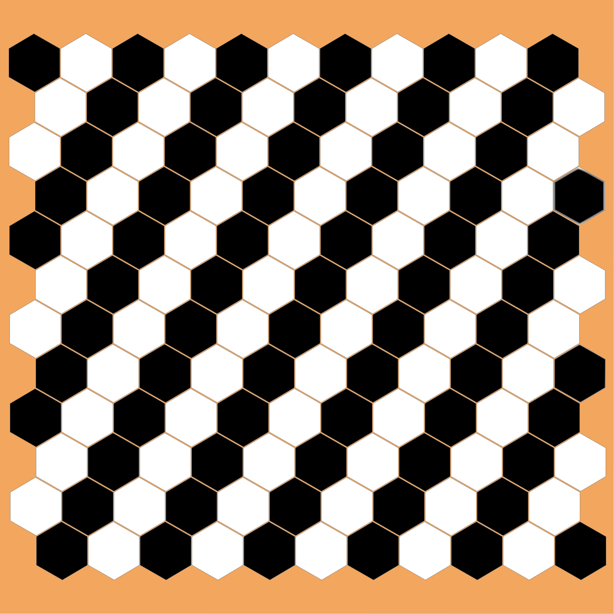
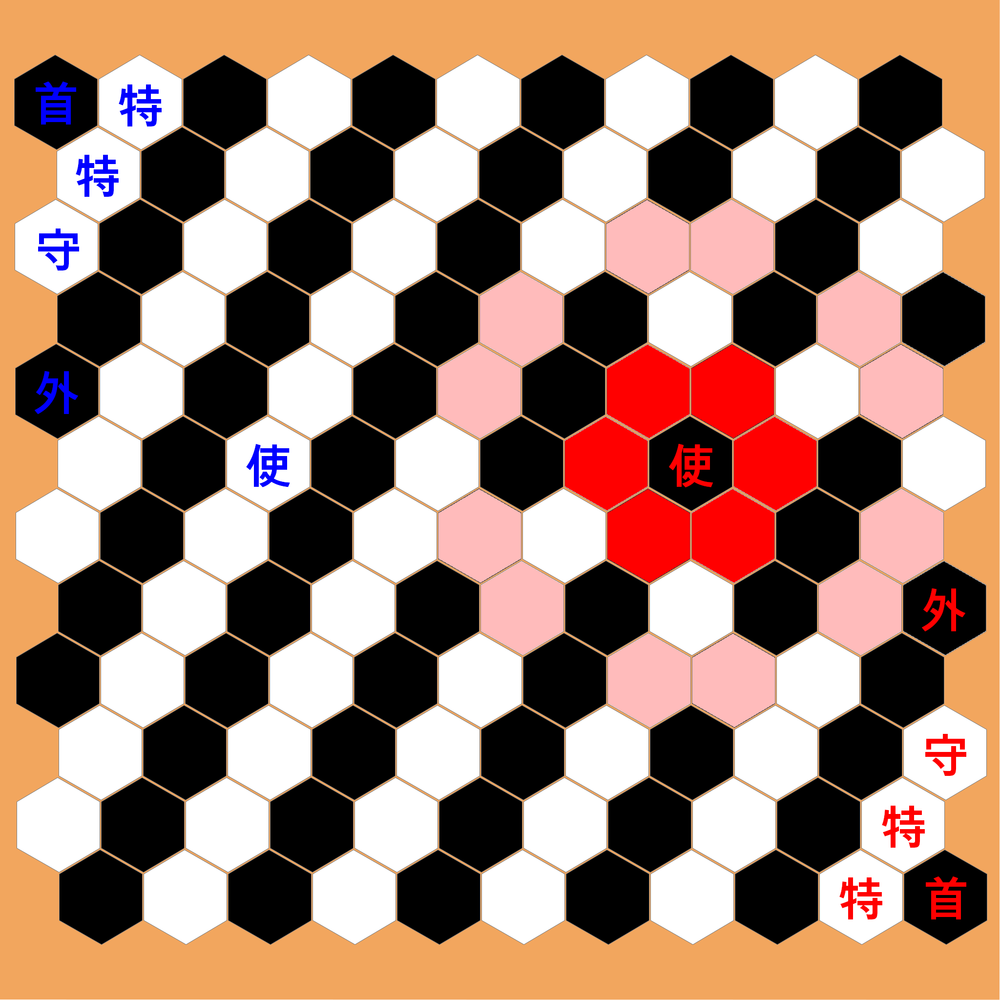
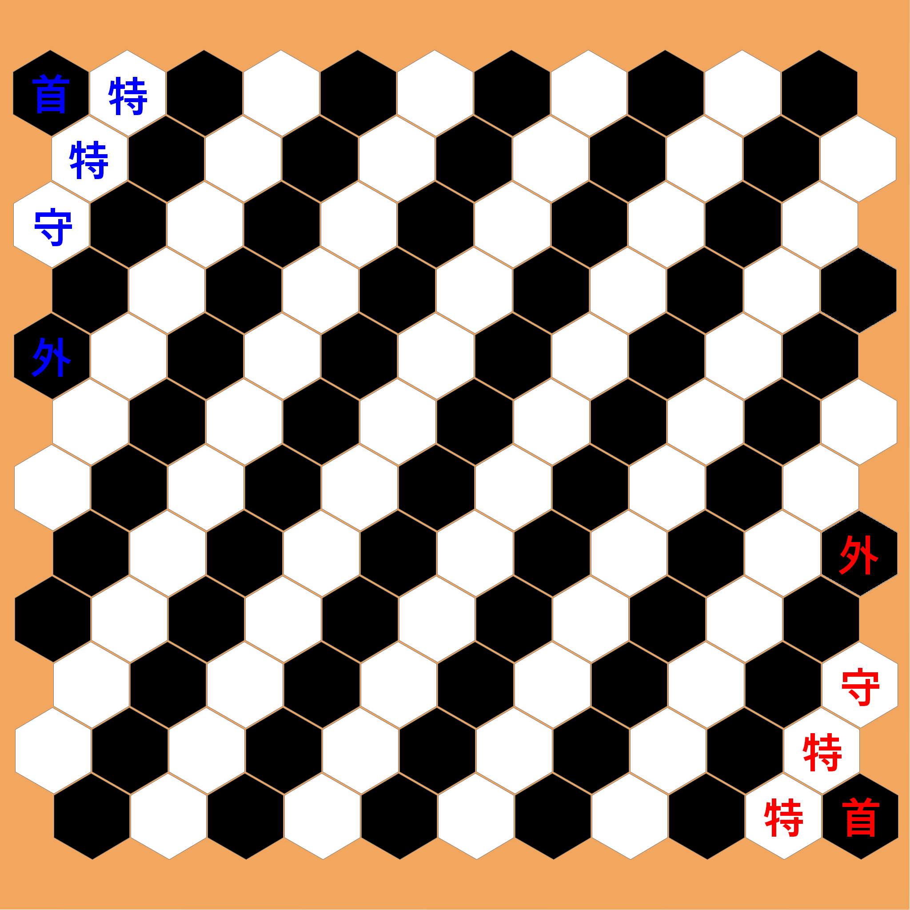
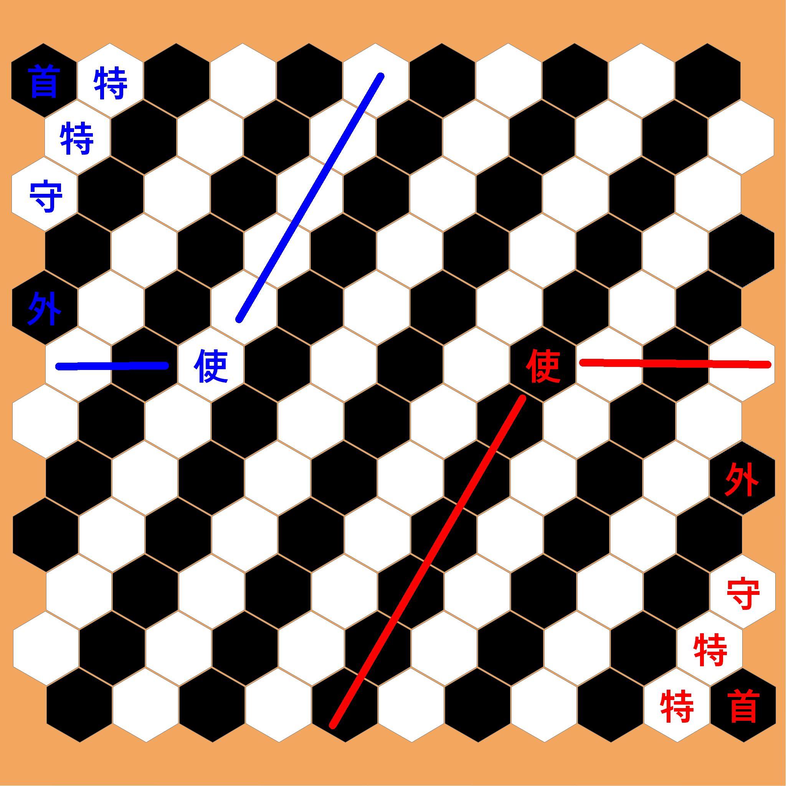

# 체둑(CheDuk) 규칙서

### 0. 요약
체둑은 체스·장기에서 영감을 받아 육각형 타일 위에서 진행되는 2인용 추상전략 보드게임이다. 체둑의 특이점으로는 두 가지 승리 조건이 공존한다는 것이며, 각 승리 조건을 요약하면 다음과 같다.
1.  **첩자(諜) 정보 루트** – 상대 영역(territory)에서 정보 5회 취득 시 즉시 승리
2.  **수반(首) 격파 루트** – 상대 국가수반을 포획 시 승리
게임의 핵심은 대사관(使館)과 영역 시스템, 그리고 각 기물의 특수 능력입니다.

---

### 1. 게임 구성

#### 1.1. 게임 판

체둑의 판은 가로 11개, 세로 12개의 정육각형 타일로 구성됩니다.

#### 1.2. 기물

한 진영당 총 11개의 기물이 있으며, 종류는 6개입니다.

---

### 2. 기물 규칙

#### 2.1. 국가수반(首) ×1
*   **역할:** 체스의 킹/장기의 궁에 해당합니다. 포획되면 즉시 패배합니다.
*   **이동:** 인접한 6방향의 빈 칸으로 1칸 이동할 수 있습니다.
*   **영역 제한:** 기본적으로 자신의 영역(Territory) 내부에서만 이동할 수 있으며, 영역의 경계선 칸까지는 이동 가능합니다.
*   **특수 이동 (캐슬링):** '외교관(外)'과의 위치 교환(캐슬링)을 통해서만 자신의 영역을 벗어나 중립 영역으로 이동할 수 있습니다. (상세는 6.1. 캐슬링 규칙 참고)

#### 2.2. 외교관(外) ×1
*   **이동:** 직선(6방향)으로 장애물 전까지 제한 없이 이동 및 공격합니다.
*   **특수 능력:** '국가수반(首)'과 위치를 교환하는 캐슬링을 할 수 있습니다.

#### 2.3. 특사(特) ×2
*   **역할:** 장기의 포(砲)와 유사하게, 다른 기물을 뛰어넘어 공격하는 기물입니다.
*   **이동/공격:** 같은 직선 상의 기물 1개(아군/적군 무관)를 뛰어넘어, 그 뒤의 원하는 칸으로 이동하거나 공격할 수 있습니다.
*   **제한:**
    *   '특사(特)'끼리는 서로를 뛰어넘거나 포획할 수 없습니다.
    *   '대사(使)'는 포획할 수 없습니다.
    *   상대에게 점령된 '대사관' 칸은 점프의 중간 경로 혹은 목표 지점으로 사용할 수 없습니다. (점령이 풀리면 제한도 즉시 해제됩니다.)

#### 2.4. 대사(使) ×1
*   **역할:** 시작 위치를 정하여 '대사관'을 설립하고, 이를 통해 영역을 구축합니다.
*   **시작:** 게임 시작 전, 플레이어가 규칙에 따라 선택한 칸에서 시작하며 이 칸이 '대사관'이 됩니다.
*   **이동 (대사관 외부로):** 체스의 나이트와 유사한 'L자' 형태로 이동합니다. (인접한 칸으로 1칸 이동 후, 진행 방향의 60° 좌/우로 꺾어 1칸 더 이동)
    *   *이동 경로의 중간 칸에 다른 기물이 있어도 뛰어넘을 수 있습니다.*
    
*   **이동 (대사관으로 복귀 시):** 인접한 6방향으로 1칸씩 이동합니다.
*   **부활:** 포획되었을 경우, 자신의 '대사관'이 현재 '비점령' 상태라면 1턴을 소모하여 대사관 칸에서 부활할 수 있습니다.
    *   *단, 아군이 대사관을 되찾은 턴에는 부활이 불가능하며, 그 다음 턴부터 가능합니다.*

#### 2.5. 첩자(諜) ×5
*   **역할:** '정보 승리' 루트의 핵심 기물입니다.
2.  **이동:** 첩자의 이동 방향은 플레이어 진영에 따라 다릅니다.
    *   **레드팀 첩자:** 현재 위치에서 60도, 120도, 180도, 240도 방향으로 1칸씩 이동할 수 있습니다.
    *   **블루팀 첩자:** 현재 위치에서 0도, 60도, 240도, 300도 방향으로 1칸씩 이동할 수 있습니다.
*   **정보 취득 (일반):**
    1.  상대 영역 내에서 1턴을 소모하여 '정보 취득'을 수행할 수 있습니다.
    2.  정보 취득 후 첩자는 그 자리에 머무르며, 이 행동으로 턴이 종료됩니다.
    3.  이후 자신의 턴에 1턴을 추가로 소모하여, 자신 영역 내의 원하는 빈 칸으로 '귀환'할 수 있습니다.
    4.  같은 칸에서는 2회 이상 정보 취득을 할 수 없습니다.
*   **정보 취득 (특수 - 대사관 점령):**
    1.  첩자가 상대의 대사관 칸으로 이동하여 점령하는 경우, 즉시 정보 1점을 획득합니다.
    2.  이 경우, 첩자는 추가 턴 소모 없이 그 즉시 자신의 영역으로 귀환합니다.
*   **부활:** 포획되었을 경우, 횟수 제한 없이 1턴을 소모하여 자신 영역 내의 원하는 빈 칸에서 부활할 수 있습니다. 이 행동은 턴 전체를 소모합니다.

#### 2.6. 경호원(守) ×1
*   **역할:** 주요 기물을 보호하고 상대 첩자를 견제합니다.
*   **이동:** 인접한 6방향으로 1칸 이동합니다.
*   **특수 능력 (부착):**
    1.  1턴을 소모하여 인접한 아군 기물에 '부착'할 수 있습니다. 부착된 경호원은 숙주 기물과 같은 칸을 차지합니다.
    2.  부착된 상태의 경호원은 특사의 점프 계산 시 장애물로 취급되지 않습니다.
    3.  부착 해제 시에는 1턴을 소모하여 인접한 빈 칸으로 이동합니다.
*   **피격 규칙:** 부착된 기물이 공격받을 경우, 숙주 기물 대신 **경호원만 제거**됩니다. 공격한 기물은 원래 위치에 남으며, 이는 공격 기물이 특사(特)일 경우에도 동일하게 적용됩니다.
*   **첩자 방해:** 경호원에 인접한 칸에서는 상대 첩자가 정보 취득을 할 수 없습니다.

---

### 3. 게임 준비 (Setup)

#### 3.1. 초기 배치

'국가수반(首)', '외교관(外)', '특사(特)', '경호원(守)' 기물은 정해진 위치에서 시작합니다.

#### 3.2. 대사 배치 및 선후공 결정
1.  양 플레이어는 상대가 모르는 상태에서 동시에 자신의 '대사(使)'를 규칙에 따라 배치합니다. 이 위치가 '대사관'이 됩니다.
2.  중앙 기준점에서 더 가까운 거리에 대사를 배치한 플레이어가 선공을 잡습니다.

#### 3.3. 첩자 배치
1.  대사 배치가 끝나면, 후공 플레이어부터 번갈아 가며 자신의 영역 내에 '첩자(諜)' 5개를 배치합니다.
2.  **선후공 동률 시:** 만약 양측의 대사 거리가 같다면, 첩자 5개의 중앙 기준점으로부터의 거리 총합을 비교하여 더 작은 쪽이 선공이 됩니다. 이마저 같다면 무작위(코인 토스 등)로 결정합니다.

---

### 4. 영역(Territory) 및 중립 영역

#### 4.1. 영역의 정의

대사관 칸을 중심으로, **가로축으로 ±3칸, 대각축으로 ±4칸 범위**의 육각 칸들이 해당 진영의 영역이 됩니다. 두 영역은 서로 겹치지 않습니다.

#### 4.2. 중립 영역
영역에 속하지 않는 모든 칸은 '중립 영역'입니다.
*   중립 영역에서는 모든 일반 이동과 전투가 가능합니다.
*   단, 첩자의 '정보 취득', '귀환', '부활'은 중립 영역에서 수행할 수 없습니다.

---

### 5. 턴 구조와 행동
한 턴에 자신의 기물 하나를 선택하여, 다음 행동 중 하나를 수행합니다.
1.  **이동/공격:** 기물의 규칙에 따라 이동하거나 상대 기물을 잡습니다.
2.  **특수 행동:** 정보 취득, 귀환, 부활, 캐슬링, 경호원 부착/해제 등 턴을 소모하는 고유 행동을 합니다.

---

### 6. 특수 규칙 상세

#### 6.1. 캐슬링 (수반 ↔ 외교관)
*   게임당 1회만 가능합니다.
*   수반과 외교관 사이의 모든 칸이 비어 있어야 합니다.
*   두 기물이 이전에 움직였어도 사용 가능합니다.
*   사용 시, 한 턴의 행동으로 두 기물이 동시에 위치를 교환합니다.

#### 6.2. 대사관 점령
*   상대 기물이 아군 대사관 칸으로 이동하면 '점령' 상태가 됩니다.
*   **효과:**
    1.  점령 즉시, 상대방은 정보 점수 1점을 획득합니다. (최초 1회만)
    2.  점령된 동안, 상대 '특사'는 이 칸을 경로로 사용해 점프할 수 없습니다.
*   **해제:** 아군이 대사관을 되찾으면 즉시 '비점령' 상태로 돌아오고, 특사의 이동 제한도 풀립니다.

---

### 7. 게임의 종료

#### 7.1. 승리 조건
*   **정보 승리:** 상대 영역에서 '첩자'를 통해 정보 5회를 취득하면 즉시 승리합니다.
*   **수반 격파 승리:** 상대 '국가수반'을 포획하면 즉시 승리합니다.

#### 7.2. 무승부 조건
*   **3회 동형 반복:** 동일한 게임 상황이 3번 반복될 경우, 시스템이 무승부를 제안하며 양측이 동의하면 무승부가 됩니다.
*   **합의:** 양측 합의 하에 게임을 재시작하거나 무승부로 끝낼 수 있습니다.

---

### 8. 구현을 위한 참고 노트

*   **판정 우선순위:** 모든 판정은 ①게임 종료 → ②정보 취득 → ③포획 → ④이동 → ⑤부활/귀환 순서를 따릅니다. 상위 판정이 발생하면 하위 판정은 무시됩니다.
*   **대사 이동 좌표:** Pointy-top 육각 보드 기준, 첫 이동 방향 인덱스를 `i` (0~5)라 할 때, 꺾는 이동 후 최종 도착 좌표는 `(i + 1) % 6` 또는 `(i - 1 + 6) % 6` 방향 벡터를 더하여 계산할 수 있습니다.
*   **무작위 처리:** 선후공 결정 등 무작위 요소는 온라인 모드에서 재현 가능하도록 시드 기반 난수 생성기(Pseudo RNG)를 사용합니다.